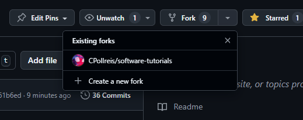
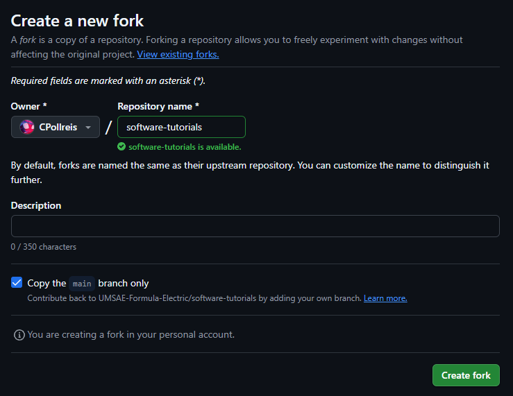
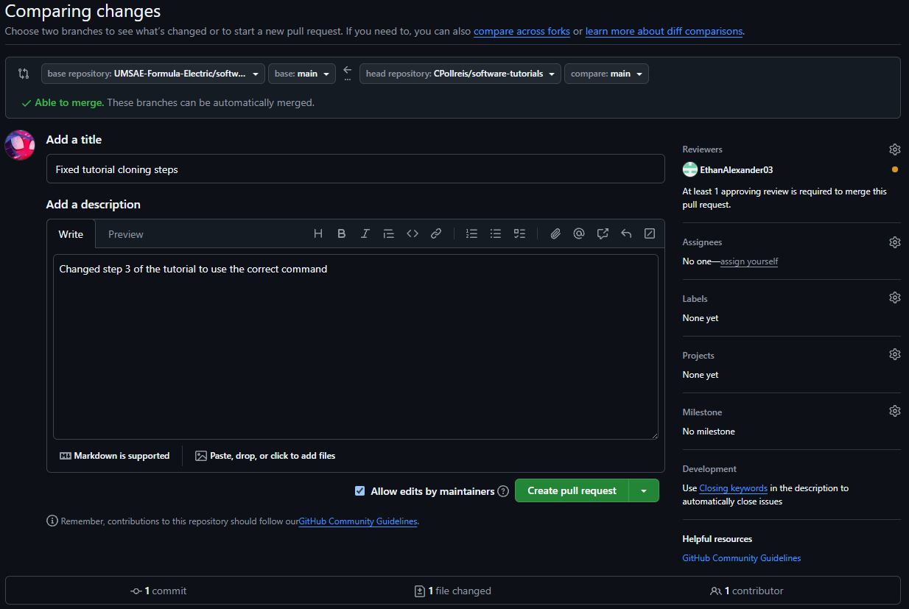

<div class="title">

# UMSAE Software Tutorials

</div>


<div id="Introduction Label">

## Introduction

</div>

Hi! Welcome to the UMSAE Formula Electric Software System! We have
created the following tutorials so new members can learn some of the
basics to start working on our vehicle. This repository outlines the
structure of the software system, provides some common terminology we
use on our team, and walks you through each tutorial. The earlier you
finish the tutorials, the earlier we can give you a task! If you need
help with any of the tutorials the Software System Officer (SSO),
Vehicle Control Software Lead (VCS), Data Acquisition Lead (DAQ), or
Software Testing Lead (SWT) for help, and we’ll guide you in the right
direction!

<div id="Helpful Resources to Get Started!">

## Helpful Resources to Get Started!

</div>

We put together some resources so you guys can learn Git, C (programming language we use on the car), and our overall team structure. You'll learn LOTS as you work on the car but before starting the tutorials we highly recommend reading the Git/GitHub info!

Below is the file structure of this repository, with some quick links to important info!

### Important Info (quick links):
- [Learning Git](./learning-git/README.md)
- [Learning C](./learning-c/README.md)
- [Team Info](./team-info/README.md)

<div id="Repository Structure">

## Repository Structure 📁

</div>

<!-- easter egg moment  -->
<!-- ```mermaid
mindmap
  root((software-tutorials))
    .git
    .github
    install-guide
      README.md
    learning-c
      README.md
    learning-git
      README.md
      Guestbook.md
      Onboarding_UMSAE_Git_Tutorial.pdf
    learning-team-info
      README.md
    Media
    tutorials
      01-blinky-led
        README.md
      02-usart
        README.md
      03-uart-interrupts
        README.md
      04-freertos
        README.md
    .gitignore
    README.md
``` -->

```
software-tutorials/
├─ .github/
├─ install-guide/
│  └─ macbook-install-guide.pdf
├─ learning-c/
│  └─ README.md
│  └─ C_programming_summary.pdf
│  └─ The.C.Programming.Language.2nd.Edition.pdf
├─ learning-git/
│  └─ README.md
├─ media/
│  └─ bunch of pictures ...
├─ team-info/
│  └─ README.md
├─ .gitignore
└─ README.md
```


<div id="Getting Started!">

## Getting Started!

</div>

1. Fork the tutorial repository
Click **Fork** at the top right of the repository, and click "create new fork".
<br><br>


2. Create the new fork on your GitHub account (add a description if you want!), click "create fork"
<br><br>


3. Clone your fork from your github profile:
- I recommend making a UMSAE folder on your computer's C or D drive and cloning the repository there!
<br><br>


```bash
git clone git@github.com:<your-name>/software-tutorials.git
cd software-tutorials
```

4. Use a branch name matching the tutorial name:

```bash
git checkout -b tutorial-01
```

5. Push your branch to GitHub:

```bash
git push -u origin tutorial-01
```

**NOTE:** For each tutorial you do, **please make a new branch on your fork!** This will give you lots of practice with git!

6. We'll come back to this in the [Submitting your work!](#submitting-your-work) section!

<div id="Downloading CubeMx and CubeIDE">

### Downloading CubeMx and CubeIDE: 

</div>

<div id="CubeMx">

### CubeMx

</div>

STM32CubeMX is a way to start some of your projects. You need to
download version **6.11.1**, which you can find on the STM32CubeMX page:
<https://www.st.com/en/development-tools/stm32cubemx.html> and create a
free account to download!

<div id="CubeIDE">

### CubeIDE

</div>

CubeIDE is the IDE we use to program our STM32 microcontrollers on our
various PCBs (ACU, VCU, and SCU) on our car. You need to download
version **1.15.1**, go to the STM32CubeIDE page:
<https://www.st.com/en/development-tools/stm32cubeide.html#get-software>

<div id="Hardware">

## Hardware

</div>

The STM32-F446RE is the development board we use to flash programs to all the
PCBs on the car (ACU, VCU, and SCU). Unlike normal programming that can
be compiled and ran on your machine, embedded systems software is
usually written for a specific chip. Here we are using an ARM Cortex M4
base chip, and we need to buy the corresponding dev board to develop
for it. It costs about $30, so the SSO will get a list of new members
and make a mass order of boards.

<div id="Tutorial Projects Label">

## Tutorial Projects

</div>

These projects will give you an introduction to embedded systems
development. Our code base uses the Hardware Abstraction Layer (HAL)
library for the STM32. Hardware Abstraction Layer (HAL) is one layer
above Standard Peripheral Library (SPL), and as the name suggests, HAL
abstracts SPL functions. Once you finish a tutorial, tell your SSO. They
will likely want to see your code to make sure everything is done
correctly, or if they have any tips on good practice/optimization.

A section lead or the SSO will review a few pull requests (PRs) from each new member. The goal
is to teach you how to submit PRs and give you guys feedback on your work :)

You can find the tutorials in the `tutorials` folder, but here are links to the instructions for you!

- [Tutorial 1](./tutorials/01-blinky-led/README.md)
- [Tutorial 2](./tutorials/02-usart/README.md)
- [Tutorial 3](./tutorials/03-uart-interrupts/README.md)
- [Tutorial 4](./tutorials/04-freertos/README.md)

<div id="GitHub Tutorial">

## Submitting your work!

</div>

<div id = "Pushing Tutorials to Github">

### Pushing Tutorials to GitHub

</div>

**NOTE:** After you finish each tutorial please refer back to these instructions and please follow them carefully!
- Help yourself by referencing the [Learning Git](./learning-git/README.md) section!

1. Take your working STM32 project folder (for the specific tutorial) and drag it into the empty folder with the same tutorial name, here's an example of what it should look like:
<br><br>


2. Stage and Commit your work!

```bash
git add .
git commit -m "Added tutorial 01 blinky LED project"
```

3. Open a Pull Request (PR)

- Go to your fork on GitHub, and click `Open pull request`.
<br><br>


- Here's an example of a PR for you to follow. Please add one of the software system leads to the PR so we can review it!
<br><br>


- Click `Create pull request` and wait for a review! ❤️

4. Wait for a Review!

- We will review and comment on your work! Once complete, we will close your PR without merging, so future members can attempt the tutorial independently.
